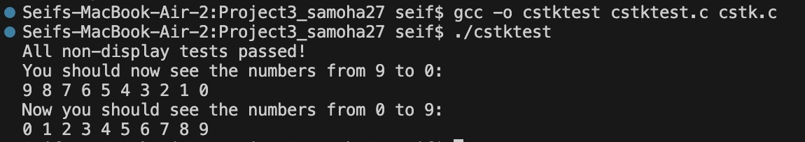

# CS333 - Project 2 - README
### SeifEdlin Abdelhamid 
### 03/17/2025

***Google Sites Report: [text](https://sites.google.com/colby.edu/seifsproject1/home)

## Directory Layout:
```
proj02/
|
|__/C/
|  |
|  |__/task1.c
|  |__/task2.c
|  |__/task3.c
|  |__/task4.c

```
## OS and C compiler
OS: OSX Ventura 13.6.7 
C compiler: Apple clang version 15.0.0 (clang-1500.0.40.1)

## Part I 
### task 1: This code defines a stack (LIFO) data structure in C using a dynamically allocated array. It provides function declarations for creating, checking, modifying, and destroying the stack. The stack supports operations such as push, pop, peek, display, and copy.

**Compile: gcc main.c cstk.c -o stack_program

**Run: ./stack_program

**Output:**


 
### task 2: This C program implements a stack (LIFO) data structure using dynamically allocated memory. It includes functions to create, check, modify, copy, display, and destroy a stack. The stack allows pushing and popping elements while ensuring proper memory management.


### task 3: This is the test file (cstktest.c) for verifying the functionality of the stack (LIFO) implementation in cstk.c. It performs a series of tests to ensure that stack operations such as creation, push, pop, peek, full/empty checks, copy, and display work correctly. The final test also allows for visual confirmation of memory management to ensure stk_destroy properly frees memory. 

**Compile: gcc -o cstktest cstktest.c cstk.c

**Run: ./cstktest

**Output:**



### task 4: At the end of the test file is a commented out section referring to checking the functionality of stk_destroy. First, uncomment the lines, open up your relevant resource monitor, and record a video that shows despite the "infinite" creation of stacks, your computer's memory doesn't get used up. Include this video in your submission folder or include a link to the video in your report.


**Output:**


### task 5:


### task 6:


## Part II - Go language
###task 1: The program demonstrates variable scope in Go. A global variable is accessible throughout the package, while a local variable is limited to its function. A block-scoped variable exists only within its {} block. Attempting to access a variable outside its scope results in an error. The output confirms these restrictions, showing how variable accessibility depends on where it is declared.

**Compile: Go is already compiled , so we don't need to worry about compilimg the code before running it.

**Run: go run task1.go

**Output: 

I'm global
I'm local
I'm inside a block
I'm global


###task 2: The program implements binary search in Go. It searches for a target value in a sorted array by repeatedly dividing the search range in half. If the target is found, it returns the index; otherwise, it returns -1. The main function tests this with an example array and prints whether the target is found.

**Compile: Go is already compiled , so we don't need to worry about compilimg the code before running it.

**Run: go run task2.go

**Output: 

Element found at index 3


###task 3: The program demonstrates basic Go data types, including integers, floats, booleans, and strings, along with aggregate types like arrays, slices, maps, and structs. It also showcases type conversion and basic arithmetic operations before printing the values.

**Compile: Go is already compiled , so we don't need to worry about compilimg the code before running it.

**Run: go run task3.go

**Output: 

10 5.5 true Hello, Go! 11 2 31 14 5 61 maplone:1 two:21 {Alice 25}
Sum: 15


###task 4: The program demonstrates Go's control structures, including if-else statements, switch cases, for loops, and range-based iteration. It also shows how Go lacks while loops but uses for for all iterations. Additionally, it includes a goto statement example, which is rarely used in Go.

**Compile: Go is already compiled , so we don't need to worry about compilimg the code before running it.

**Run: go run task4.go

**Output: 

x is greater than 5
X is 10
Loop: 0
Loop: 1
Loop: 2
Index 0: a
Index 1: b
Index 2: c
Before Goto 
After Goto


###task 5: The program demonstrates function types, higher-order functions, and anonymous functions in Go. It defines a function type operation, assigns a function to a variable, passes functions as arguments, and uses an inline anonymous function for subtraction.

**Compile: Go is already compiled , so we don't need to worry about compilimg the code before running it.

**Run: go run task5.go

**Output: 

Sum: 7
Result: 15
Difference: 7


## Extensions
###extension 1
**Description: Write other example programs that show unique features of the syntax, naming, or scoping in the selected language.


**Output: 
Sum: 15
Diff: 5

###extension 2
**Description: Develop explicit comparison code in Python, Java, or C and compare and contrast it with your selected language.


###extension 3
**Description: If the selected language has a built-in capability for binary search, include an example of using it.

**Output: Found 7 at index 3


###extension 4
**Description: Make a compilable and runnable haiku in the selected language. Less strict forms of poetry are also acceptable. Note, this is generally a minor extension in terms of points, but it can be fun.

**Output:

Code flows like a stream, 
Logic dances in silence, 
Bugs fade with the dawn.
